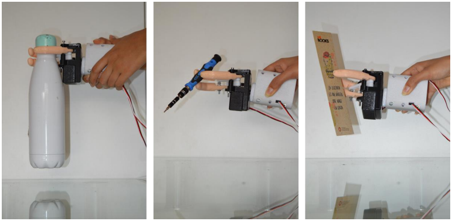

# EMG Signal Classification

 

## Introduction
This project aims to preprocess EMG signals and classify them into three classes using AI techniques to control a 3d printed prosthesis.

### Tools:
- [ESP32 C3](https://www.espressif.com/en/products/socs/esp32-c3)
- [MyoWare sensors](https://cdn.sparkfun.com/datasheets/Sensors/Biometric/MyowareUserManualAT-04-001.pdf)
- Servo motors
- [SD card module](https://create.arduino.cc/projecthub/electropeak/sd-card-module-with-arduino-how-to-read-write-data-37f390)
- Computer

## Data collection
[src/data_collection](https://github.com/kaviles22/EMG_SignalClassification/blob/main/src/data_collection)

For this stage, a computer, running a python script and an Esp32c3, communicated using bluetooth low energy (BLE). The computer was in charge of indicating the tests subject when to start performing a certain muscular action. The esp32c3 was in charge of recording the emg data using 3 MyoWare sensors, labeling it and saving it on an SD card.

Note: the ideal would have been to send the data via bluetooth to the computer, however we were unable to find a way to do this quickly without affecting the data recording process which was done at a frequency of 1kHz. 

### Screen visuals
The python script shows visual signs on the screen, representing each one of the actions. Between each recording interval, a resting sign appears, which means the test subject can stop performing the previous action.

## Preprocessing
Preprocessing data is an important step, specially when working with biological signals.

### Filtering
To filter out the noise we used the RMS Envelope technique, which was calculated in a 50 ms wide window.

### Normalization
The peak dynamic method was used, which consists on representing each signal as a ratio of the peak value of that time window. Values were kept between [0, 1].
  
  

### Feature extraction
[src/feature_extraction/feature_extraction.ipynb](https://github.com/kaviles22/EMG_SignalClassification/blob/main/src/feature_extraction/feature_extraction.ipynb) 
Two approaches were analyzed:
1. Statistical features
2. RMS in time windows: extracting the rms value in subwindows.

## Training and converting the TF model to a TF Lite model
[src/train_model/train_test_model.py](https://github.com/kaviles22/EMG_SignalClassification/blob/main/src/train_model/train_test_model.py) 
A tensorflow model was trained and then converted into a TF Lite model. 

## Deploying model and testing it on real-time.
The whole pipeline was deployed on a ESP-C3 development board. The code was written in C++ and the model output was used to activate 2 servo motors to move the 3d printed prosthesis. 

